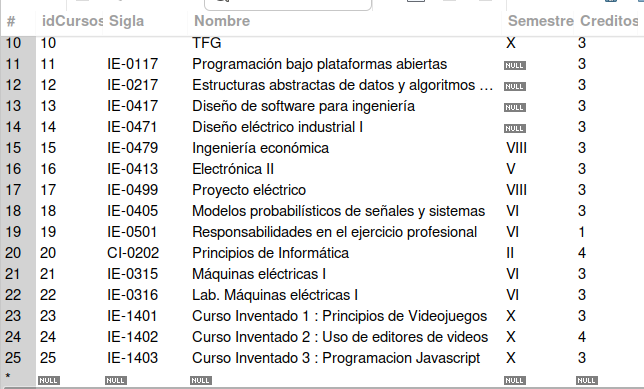
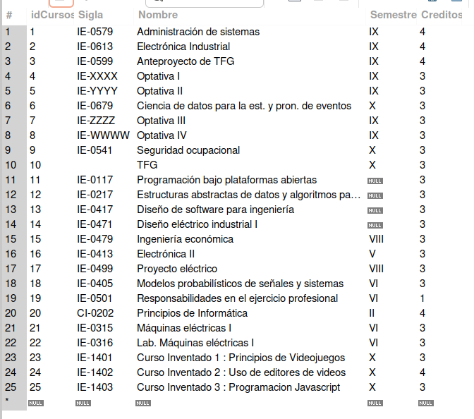

# Tarea6 / Oscar Porras Silesky

### Parte Teórica / Preguntas sobre Bases de Datos

#### 1. ¿Qué es una base de datos relacional y cuáles son sus características fundamentales?
Una base de datos relacional es un tipo de base de datos que organiza la información en tablas relacionadas entre sí. Las características fundamentales incluyen:
- **Estructura tabular**: Los datos se almacenan en tablas compuestas por filas y columnas.
- **Integridad de datos**: Se asegura mediante el uso de claves primarias y claves foráneas.
- **Manipulación de datos**: Se realiza a través de operaciones como selección, inserción, actualización y eliminación.
- **Consultas eficientes**: Se utilizan lenguajes como SQL para realizar consultas complejas de manera eficiente.

#### 2. ¿Cuál es la diferencia entre una clave primaria y una clave candidata en una base de datos relacional?
- **Clave Primaria**: Es un conjunto de uno o más campos que identifican de manera única cada fila en una tabla. No puede contener valores nulos.
- **Clave Candidata**: Es un conjunto de atributos que podrían servir como clave primaria, es decir, también son únicos para cada fila y no contienen valores nulos. La diferencia principal es que la clave primaria es la clave candidata seleccionada para identificar registros.

#### 3. ¿Qué son las claves foráneas y cómo se utilizan para mantener la integridad referencial en una base de datos?
Las claves foráneas son atributos en una tabla que hacen referencia a las claves primarias de otra tabla. Se utilizan para mantener la integridad referencial, asegurando que no se pueda agregar una referencia a una entidad que no existe. Esto ayuda a mantener la consistencia y la fiabilidad de los datos.

#### 4. ¿Qué es una transacción en el contexto de bases de datos y cuáles son las propiedades ACID que debe cumplir?
Una transacción en bases de datos es una serie de operaciones que se ejecutan como una unidad lógica de trabajo. Para asegurar la confiabilidad, una transacción debe cumplir las propiedades ACID:
- **Atomicidad**: La transacción se realiza en su totalidad o no se realiza en absoluto.
- **Consistencia**: La transacción transforma la base de datos de un estado consistente a otro.
- **Aislamiento**: Los efectos intermedios de una transacción en proceso son invisibles para otras transacciones.
- **Durabilidad**: Una vez que la transacción se ha completado, sus efectos son permanentes.

#### 5. ¿Qué son las vistas (views) en SQL y cuáles son los beneficios y limitaciones de su uso?
Las vistas en SQL son representaciones virtuales de una o más tablas. Se crean con consultas y se comportan aparentemente como tablas regulares. Los beneficios incluyen:
- **Seguridad**: Limita el acceso a los datos al exponer solo una parte de ellos.
- **Simplicidad**: Simplifica las consultas complejas, actuando como una abstracción que oculta la complejidad.
- **Consistencia**: Proporciona una interfaz constante a los datos, incluso si las estructuras subyacentes cambian.

Las limitaciones son:
- **Rendimiento**: Puede ser inferior al de las consultas directas debido al procesamiento adicional.
- **Actualizaciones**: No todas las vistas son actualizables, y las vistas que involucran múltiples tablas o funciones agregadas generalmente no lo son.

#### 6. ¿Qué es la normalización en bases de datos y cuáles son las diferentes formas normales (normal forms)?
La normalización en bases de datos es un proceso para reducir la redundancia y mejorar la integridad de los datos mediante la organización de campos y relaciones de tablas. Las formas normales son un conjunto de reglas para evaluar el nivel de normalización de una base de datos. Las principales son:
- **Primera forma normal (1NF)**: Requiere que todos los valores de las columnas sean atómicos y que la tabla tenga una clave primaria.
- **Segunda forma normal (2NF)**: Además de cumplir con 1NF, no debe haber dependencia funcional parcial de ningún atributo sobre la clave primaria.
- **Tercera forma normal (3NF)**: Requiere cumplir con 2NF y que no haya dependencias funcionales transitivas en atributos no primarios.
- **Forma normal de Boyce-Codd (BCNF)**: Una versión más estricta de 3NF, donde cada determinante es una clave candidata.

#### 7. ¿Cómo funcionan los índices en SQL y cuál es su impacto en el rendimiento de las consultas?
Los índices en SQL son estructuras de datos que mejoran la velocidad de las operaciones de recuperación de datos, pero pueden ralentizar las operaciones de inserción, actualización y eliminación debido al mantenimiento adicional. Funcionan creando un punto de acceso rápido a los datos que se almacenan de manera más eficiente. El impacto en el rendimiento de las consultas es significativo, especialmente en tablas grandes, ya que permiten evitar la lectura secuencial de toda la tabla.

#### 8. ¿Qué es SQL Injection y cuáles son las mejores prácticas para prevenir este tipo de ataque?
SQL Injection es una técnica de ataque que consiste en insertar o "inyectar" un código SQL malicioso a través de los datos de entrada que se ejecutan en el servidor de base de datos. Para prevenirlo, las mejores prácticas incluyen:
- Utilizar consultas parametrizadas o procedimientos almacenados para asegurar que los parámetros sean tratados como datos y no como código.
- Validar y sanitizar todas las entradas de los usuarios para asegurar que cumplen con los formatos esperados.
- Aplicar el principio de menor privilegio, limitando los permisos de las cuentas de bases de datos utilizadas en las aplicaciones.

#### 9. ¿Qué son los procedimientos almacenados (stored procedures) en SQL y cómo pueden mejorar la eficiencia y seguridad de las operaciones de base de datos?
Los procedimientos almacenados son bloques de código SQL que se almacenan en la base de datos y se ejecutan desde la aplicación. Mejoran la eficiencia ya que el código se compila una vez y se almacena para ejecuciones posteriores, reduciendo la carga de compilación en el servidor de base de datos. En cuanto a la seguridad, los procedimientos almacenados encapsulan el código de operaciones, lo que ayuda a prevenir inyecciones de SQL y reduce la exposición de datos.

#### 10. ¿Cómo se implementan las relaciones uno a uno, uno a muchos y muchos a muchos en una base de datos relacional y qué consideraciones se deben tener en cuenta en cada caso?
- **Relaciones uno a uno**: Se implementan mediante la inclusión de una clave primaria de una tabla como clave única en otra tabla. Es importante asegurarse de que la integridad referencial se mantenga correctamente para evitar inconsistencias.
- **Relaciones uno a muchos**: Se manejan incluyendo una clave primaria de la tabla principal como una clave foránea en la tabla secundaria. Deben diseñarse cuidadosamente para garantizar que las operaciones de actualización y eliminación no violen la integridad de los datos.
- **Relaciones muchos a muchos**: Requieren una tabla intermedia que incluya las claves primarias de ambas tablas relacionadas como claves foráneas. Esta tabla facilita la gestión de las relaciones y ayuda a mantener la integridad referencial y la normalización.


### Parte Práctica /


#### Creación del Esquema

1. **Creación del Esquema de la Base de Datos**

Para la creación inicial de la base de datos, se utilizó el workbench para la creación del esquema y las tablas.


```sql
-- MySQL Script generated by MySQL Workbench
-- Wed Jun 12 17:07:08 2024
-- Model: New Model    Version: 1.0
-- MySQL Workbench Forward Engineering

SET @OLD_UNIQUE_CHECKS=@@UNIQUE_CHECKS, UNIQUE_CHECKS=0;
SET @OLD_FOREIGN_KEY_CHECKS=@@FOREIGN_KEY_CHECKS, FOREIGN_KEY_CHECKS=0;
SET @OLD_SQL_MODE=@@SQL_MODE, SQL_MODE='ONLY_FULL_GROUP_BY,STRICT_TRANS_TABLES,NO_ZERO_IN_DATE,NO_ZERO_DATE,ERROR_FOR_DIVISION_BY_ZERO,NO_ENGINE_SUBSTITUTION';

-- -----------------------------------------------------
-- Schema Tarea06DB
-- -----------------------------------------------------

-- -----------------------------------------------------
-- Schema Tarea06DB
-- -----------------------------------------------------
CREATE SCHEMA IF NOT EXISTS `Tarea06DB` DEFAULT CHARACTER SET utf8 ;
USE `Tarea06DB` ;
```
- Esquema: `Tarea06DB`

La base de datos antes de crearse el esquema se veía de la siguiente forma:


Luego de correr el código de creación, pasó a verse  así:


2. **Creación de la Tablas `Cursos`, `Requisitos` y `Descripciones`**

```sql
-- -----------------------------------------------------
-- Table `Tarea06DB`.`Cursos`
-- -----------------------------------------------------
CREATE TABLE IF NOT EXISTS `Tarea06DB`.`Cursos` (
  `idCursos` INT UNSIGNED NOT NULL AUTO_INCREMENT,
  `Sigla` CHAR(7) DEFAULT NULL,
  `Nombre` VARCHAR(200) NOT NULL,
  `Semestre` VARCHAR(4) DEFAULT NULL,
  `Creditos` INT UNSIGNED NOT NULL,
  PRIMARY KEY (`idCursos`),
  UNIQUE INDEX `idCursos_Cursos_UNIQUE` (`idCursos` ASC) VISIBLE,
  UNIQUE INDEX `Sigla_UNIQUE` (`Sigla` ASC) VISIBLE,
  UNIQUE INDEX `Nombre_UNIQUE` (`Nombre` ASC) VISIBLE,
  INDEX `Semestre` (`Semestre` ASC) VISIBLE,
  INDEX `Creditos` (`Creditos` ASC) VISIBLE)
ENGINE = InnoDB;


-- -----------------------------------------------------
-- Table `Tarea06DB`.`Requisitos`
-- -----------------------------------------------------
CREATE TABLE IF NOT EXISTS `Tarea06DB`.`Requisitos` (
  `RequisitoID` INT UNSIGNED NOT NULL AUTO_INCREMENT,
  `CursoID` INT UNSIGNED NOT NULL,
  `RequisitoCursoID` INT UNSIGNED NOT NULL,
  PRIMARY KEY (`RequisitoID`),
  UNIQUE INDEX `RequisitoID_UNIQUE` (`RequisitoID` ASC) VISIBLE,
  INDEX `CursoID` (`CursoID` ASC) VISIBLE,
  INDEX `RequisitoCursoID` (`RequisitoCursoID` ASC) VISIBLE,
  CONSTRAINT `fk_Requisitos_CursoID`
    FOREIGN KEY (`CursoID`)
    REFERENCES `Tarea06DB`.`Cursos` (`idCursos`)
    ON DELETE NO ACTION
    ON UPDATE NO ACTION,
  CONSTRAINT `fk_Requisitos_RequisitoCursoID`
    FOREIGN KEY (`RequisitoCursoID`)
    REFERENCES `Tarea06DB`.`Cursos` (`idCursos`)
    ON DELETE NO ACTION
    ON UPDATE NO ACTION)
ENGINE = InnoDB;


-- -----------------------------------------------------
-- Table `Tarea06DB`.`Descripciones`
-- -----------------------------------------------------
CREATE TABLE IF NOT EXISTS `Tarea06DB`.`Descripciones` (
  `DescripcionID` INT UNSIGNED NOT NULL AUTO_INCREMENT,
  `CursoID` INT UNSIGNED NOT NULL,
  `Descripcion` TEXT NOT NULL,
  `Dificultad` VARCHAR(7) NOT NULL,
  PRIMARY KEY (`DescripcionID`),
  UNIQUE INDEX `DescripcionID_UNIQUE` (`DescripcionID` ASC) VISIBLE,
  UNIQUE INDEX `CursoID_UNIQUE` (`CursoID` ASC) VISIBLE,
  FULLTEXT INDEX `Descripcion` (`Descripcion`) VISIBLE,
  INDEX `Dificultad` (`Dificultad` ASC) VISIBLE,
  CONSTRAINT `fk_Descripciones_CursoID`
    FOREIGN KEY (`CursoID`)
    REFERENCES `Tarea06DB`.`Cursos` (`idCursos`)
    ON DELETE NO ACTION
    ON UPDATE NO ACTION)
ENGINE = InnoDB;


SET SQL_MODE=@OLD_SQL_MODE;
SET FOREIGN_KEY_CHECKS=@OLD_FOREIGN_KEY_CHECKS;
SET UNIQUE_CHECKS=@OLD_UNIQUE_CHECKS;
```

De modo que las tablas al ser recién creadas se vieron de la siguiente manera:

Primero, la tabla delos Cursos.


Segundo, la tabla de los Requisitos.


Tercero, la tabla de las Descripciones.


#### Inserción de Datos

1. **Inserción de Datos en la Tabla `Cursos`**

Seguidamente, se procedió a insertar en la tabla de Cursos los cursos del plan de licenciatura.

```sql
INSERT INTO `Tarea06DB`.Cursos(Sigla, Nombre, Semestre, Creditos)
VALUES ("IE-0579", "Administración de sistemas", "IX", 4),
       ("IE-0613", "Electrónica Industrial", "IX", 4),
       ("IE-0599", "Anteproyecto de TFG", "IX", 4),
       ("IE-XXXX", "Optativa I", "IX", 3),
       ("IE-YYYY", "Optativa II", "IX", 3),
       ("IE-0679", "Ciencia de datos para la est. y pron. de eventos", "X", 3),
       ("IE-ZZZZ", "Optativa III", "IX", 3),
       ("IE-WWWW", "Optativa IV", "IX", 3),
       ("IE-0541", "Seguridad ocupacional", "X", 3),
       ("", "TFG", "X", 3);
```

Del modo que la tabla se ve así:


Luego, se procedió a insertar los cursos optativos deseados.

```sql
INSERT INTO `Tarea06DB`.Cursos(Sigla, Nombre, Creditos)
VALUES ("IE-0117", "Programación bajo plataformas abiertas", 3),
       ("IE-0217", "Estructuras abstractas de datos y algoritmos para ingeniería", 3),
       ("IE-0417", "Diseño de software para ingeniería", 3),
       ("IE-0471", "Diseño eléctrico industrial I", 3);
```

De modo que la tabla de Cursos pasó a verse así:


Por último, se agregaron los requisitos de los cursos del plan y las optativas:

```sql
INSERT INTO `Tarea06DB`.Cursos(Sigla, Nombre, Semestre, Creditos)
VALUES("IE-0479", "Ingeniería económica", "VIII", 3),
      ("IE-0413", "Electrónica II", "V", 3),
      ("IE-0499", "Proyecto eléctrico", "VIII", 3),
      ("IE-0405", "Modelos probabilísticos de señales y sistemas", "VI", 3),
      ("IE-0501", "Responsabilidades en el ejercicio profesional", "VI", 1),
      ("CI-0202", "Principios de Informática", "II", 4),
      ("IE-0315", "Máquinas eléctricas I", "VI", 3),
      ("IE-0316", "Lab. Máquinas eléctricas I", "VI", 3);
```

De modo que la tabla de Cursos completa quedó así:


2. **Inserción de Datos en la Tabla `Requisitos`**

En el caso de la tabla de Requisitos, se realizó la lógica de dependencias:

```sql
INSERT INTO `Tarea06DB`.Requisitos(CursoID, RequisitoCursoID)
VALUE(1,15), (2,21), (2,16), (3,17), (6,18),
(9,19), (10,20), (12,11), (13,12), (14,21),
(14,22), (6,1);
```

De modo que la tabla de Requisitos quedó así:


3. **Inserción de Datos en la Tabla `Descripciones`**

Después se procedió a llenar la tabla de Descripciones:

```sql
INSERT INTO `Tarea06DB`.Descripciones(CursoID, Descripcion, Dificultad)
VALUE(1, "El profesional en ingeniería eléctrica se verá, tan pronto se incorpore al mercado laboral, en actividades técnicas que se relacionarán con diferentes tipos de organizaciones o empresas, leyes, reglamentos, normativas y muchos otros condicionantes, cuyo funcionamiento es una responsabilidad conocer.

Por ello, en este curso, se considerará la organización o empresa como la unidad de estudio, sobre la cual se desarrollará el análisis de factores internos y externos tales como geopolítica, evolución tecnológica, globalización de mercados, cambios económicos, transformaciones del mercado, papel del estado, y otros, aspectos que gravitan en el adecuado accionar de estos sistemas.", "Media"),
     (2, "El curso permite introducir los principios y fundamentos de la electrónica de
potencia.", "Dificil"),
     (3, "El curso de Anteproyecto de Tesis es un curso orientado a desarrollar en el estudiante las habilidades necesarias para elaborar su propuesta de investigación.", "Media"),
     (4, "", ""),
     (5, "", ""),
     (6, "Integra la formación profesional del estudiante de Ingeniería Eléctrica mediante la aplicación de conceptos estudiados en cursos anteriores, junto con nuevas herramientas que permitan apoyar de manera sistémica el proceso de análisis de eventos", "Dificil"),
     (7, "", ""),
     (8, "", ""),
     (9, "El curso de Salud y Seguridad Ocupacional ofrece una visión integral sobre la importancia de mantener un ambiente laboral seguro y saludable. Abarca el Reglamento de Hostigamiento Sexual según la Ley 7476, una introducción a la Salud Ocupacional y sus antecedentes históricos, tanto a nivel mundial como en Costa Rica. El curso destaca la relevancia de la salud y seguridad en el trabajo, abarcando conceptos esenciales como salud, trabajo, ambiente, riesgos laborales y daños ocupacionales. Se explora la Salud Ocupacional como una ciencia interdisciplinaria y su relación con la competitividad empresarial. Además, se analizan factores de riesgo, evaluación de riesgos y la prevención de accidentes e incidentes laborales. Incluye estudios sobre la pandemia del COVID-19 y su impacto laboral, así como la importancia del consumo de agua para la salud del trabajador. Otros temas incluyen riesgos físicos, químicos, biológicos, ergonómicos y tecnológicos, junto con el uso adecuado del equipo de protección personal. También se cubren normas y reglamentos de seguridad, como el Reglamento de Seguridad en Construcción y las Normas OHSAS 45000, así como programas de mejora continua como el Programa 5 S.", "Facil"),
     (10, "", ""),
     (11, "El curso de programación bajo plataformas abiertas está diseñado para enseñar a las personas estudiantes de Ingeniería Eléctrica, un conjunto de conocimientos de tipo teórico-prácticos, con el fin de brindar la preparación para abordar y resolver problemas ingenieriles, mediante el uso de herramientas y el desarrollo de programas de aplicación utilizando plataformas abiertas.

El curso se enfoca en dos objetivos. Por un lado, la instalación, utilización y administración de plataformas abiertas, en particular, sistemas operativos GNU/Linux (Ubuntu). En segunda instancia, el aprendizaje de lenguajes de programación multipropósito, en particular C.

Al finalizar el curso, las personas estudiantes estarán preparadas para incursionar en temas más avanzados de programación que les permitirá desarrollar soluciones a problemas afines a la carrera.", "Media"),
     (12, "El curso de Estructuras Abstractas de Datos y Algoritmos para Ingeniería tiene la finalidad de ahondar en conceptos de programación y desarrollo de algoritmos, lo que les permite a las personas estudiantes enfrentarse sistemáticamente al desarrollo de soluciones computacionales a problemas, mediante la selección de las estructuras de datos y criterios apropiados en cada situación. Al finalizar el curso, los estudiantes comprenderán los fundamentos teóricos y prácticos del uso de estructuras de datos y algoritmos más utilizados usando el lenguaje C++. Además, estarán en capacidad de proponer nuevas estructuras de datos y algoritmos para la resolución de problemas específicos.", "Dificil"),
     (13, "El curso IE0417, Diseño de Software para Ingeniería, es un curso optativo del Departamento de Automática, que otorga 3 créditos. Es un curso teórico con horas de laboratorio, distribuidas en 1 hora teórica y 5 horas de laboratorio por semana. Requiere haber completado el curso IE0217 como prerrequisito. Los contenidos del curso se dividen en cinco módulos principales. El Módulo 1 introduce a la ingeniería de software. El Módulo 2 aborda el proceso de desarrollo de software, incluyendo las etapas de desarrollo, modelos de procesos, sistemas de control de versiones y documentación. El Módulo 3 se centra en el modelado de software, cubriendo casos de uso, requerimientos, arquitectura, diseño de software, diagramas y el lenguaje de modelado UML. El Módulo 4 presenta técnicas y herramientas avanzadas para el desarrollo de software, incluyendo sistemas de construcción de proyectos y contenedores. Finalmente, el Módulo 5 trata la validación y pruebas de software, abordando la validación, sistemas de pruebas, herramientas de análisis y la integración continua.", "Dificil"),
     (14, "El curso de Diseño Eléctrico Industrial I, pretende dotar al estudiante de ingeniería eléctrica de los conocimientos básicos en el campo de diseño de sistemas eléctricos en edificaciones. Es en este curso, donde se adquieren las destrezas necesarias para entender, explicar y modelar sistemas eléctricos, poniendo énfasis en el lenguaje del diseño, normativas y métodos de cálculo. Debido a la importancia de este tema en la práctica de la ingeniería, el curso de Diseño Eléctrico I ha sido incluido dentro del programa de bachillerato.", "Media"),
     (15, "El curso IE0479, Ingeniería Económica, es un curso troncal del Departamento de Electrónica y Telecomunicaciones que otorga 3 créditos. Es un curso teórico con 4 horas teóricas por semana. Los contenidos del curso abarcan diversos aspectos de las tasas de interés, incluyendo tasas simples y compuestas, tasas efectivas y amortización. Se estudia el valor del dinero en el tiempo, el valor presente en una serie uniforme y el factor de recuperación de capital. También se aborda el uso de tablas de interés, la notación estándar de los factores, la interpolación en las tablas y la capitalización continua. Se enseñan los factores múltiples para localizar el valor presente y el valor futuro, y se estudia el costo capitalizable mediante el método del valor presente para vidas útiles iguales y diferentes. Finalmente, se incluyen métodos para el cálculo de tasas de retorno utilizando el valor presente y el método del costo anual equivalente.", "Facil"),
     (16, "Éste es un curso de electrónica analógica muy basado en el análisis y diseño de circuitos con amplificadores operacionales.", "Dificil"),
     (17, "El curso de proyecto eléctrico es un curso integrador y abierto en su temática, y de aplicación de estrategias de diseño, investigación y solución a un problema en el campo de la ingeniería eléctrica y ramas afines.

Este curso, ubicado en las etapas finales del bachillerato en ingeniería eléctrica, se distingue por su naturaleza integral y su conexión con el proceso formativo del estudiante, pues las materias previamente cursadas sirven como insumo para tener una experiencia donde el eje central sea desarrollar un proyecto guiado. De esta forma, se puede utilizar la convergencia de conocimientos adquiridos a lo largo del programa de estudios, preparando al estudiantado para los desafíos y oportunidades que le aguardan en su trayectoria académica y profesional en el desarrollo de proyectos.", "Media"),
     (18, "El curso IE0405, Modelos Probabilísticos de Señales y Sistemas, es un curso troncal del Departamento de Automática que otorga 3 créditos. Es un curso teórico con 4 horas teóricas por semana y requiere haber completado el curso IE0409 como prerrequisito. Los contenidos del curso se dividen en varias áreas clave. La teoría de la probabilidad cubre definiciones, teoría de conjuntos, análisis combinatorio, probabilidad conjunta, probabilidad condicional, independencia estadística y el teorema de Bayes. Las variables aleatorias se estudian en profundidad, incluyendo definiciones, propiedades, distribuciones y transformaciones. El curso también aborda variables aleatorias múltiples, vectores de probabilidad, operaciones y teoremas como el límite central y la ley de los grandes números. Los procesos aleatorios se examinan en términos de autocorrelación, características espectrales y aplicaciones en análisis de señales y sistemas. Finalmente, el curso cubre las cadenas de Markov, incluyendo análisis de procesos de vida y muerte, teoría de colas y aplicaciones en inferencia bayesiana y filtros de Kalman.", "Media"),
     (19, "Se trata de un curso teórico por medio del cual el estudiante se prepara para conocer sobre los diversos aspectos de la responsabilidad en el ejercicio profesional, dada la importancia que reviste dicho ejercicio en la vida social y económica del país.

La responsabilidad en el ejercicio profesional es un tema que encuentra en la ética su fundamento. La Ética estudia y establece los principios por medio de los cuales los profesionales atienden su ejercicio y lo hace a través de una de sus ramas, la ética profesional, la cual encuentra en la deontología su objeto de estudio.", "Facil"),
     (20, "Es un curso básico de programación para estudiantes del área de ingeniería y afines. En el curso se introduce al estudiante al pensamiento abstracto para la resolución de problemas de ingeniería y científicos, automatizable por medio de herramientas informáticas de desarrollo, utilizando metodologías sistemáticas. El estudiante aprenderá a reconocer la aplicabilidad de flujos de control y modelos de datos básicos para lograr el diseño e implementación de programas y algoritmos.", "Media"),
     (21, "El curso pretende familiarizar a los estudiantes, con las máquinas eléctricas estacionarias y giratorias, que se encuentran en la industria y en los sistemas eléctricos de potencia. Para tal efecto, se hace énfasis en el análisis en régimen permanente, de los transformadores eléctricos de potencia, y las máquinas de inducción trifásicas.

El curso IE-0315 está constituido por clases magistrales, donde el profesor presenta la teoría de máquinas eléctricas y desarrolla ejemplos y ejercicios, para ayudar al estudiante a mejorar su desempeño, conceptos y evaluaciones.

El curso se complementa con el Laboratorio de Máquinas Eléctricas I, IE0116. El curso IE0116 de hecho tiene como fin, ser un complemento práctico de lo aprendido en las clases teóricas. Los estudiantes que matriculan IE0315 por primera vez, deben matricular también el curso IE0316.", "Dificil"),
     (22, "El curso IE0316, Laboratorio de Máquinas Eléctricas I, es un curso troncal del Departamento de Sistemas de Potencia y Máquinas Eléctricas que otorga 1 crédito. Es un curso de laboratorio con 2 horas semanales dedicadas a prácticas. Los contenidos incluyen el estudio de circuitos y elementos lineales, tanto monofásicos como trifásicos, y el análisis de núcleos ferromagnéticos y reactores con núcleo de hierro. Además, se trabajan con transformadores monofásicos y trifásicos, motores de inducción trifásicos, tanto de jaula de ardilla como de rotor devanado, métodos de arranque de motores de inducción y generadores de inducción trifásicos.", "Facil");
```

Por lo que la tabla de Descripciones quedó así:


### Operaciones CRUD

#### Creación de Datos

##### 1. **Agregar nuevos cursos inventados por los estudiantes:**

```sql
-- -----------------------------------------------------
-- CREAR LOS DATOS
-- -----------------------------------------------------

-- 1. Agregar nuevos cursos inventados por los estudiantes:

SELECT * FROM `Tarea06DB`.Cursos;

INSERT INTO Tarea06DB.Cursos(Sigla, Nombre, Semestre, Creditos)
VALUES
("IE-1401", "Curso Inventado 1", "I", 3),
("IE-1402", "Curso Inventado 2", "II", 4),
("IE-1403", "Curso Inventado 3", "III", 3);

SELECT * FROM `Tarea06DB`.Cursos;
```

Por lo que la tabla de Cursos antes de ser modificada para agregar los cursos inventados se veía así:


Y entonces la tabla de Cursos pasó a verse de la siguiente manera:



##### 2. **Agregar descripciones para los nuevos cursos inventados:**

El código utilizado fue:

```sql
-- 2. Agregar descripciones para los nuevos cursos inventados:

SELECT * FROM `Tarea06DB`.Descripciones;

INSERT INTO Tarea06DB.Descripciones(CursoID, Descripcion, Dificultad)
VALUES
((SELECT idCursos FROM Tarea06DB.Cursos WHERE Sigla = "IE-1401"), "Descripción del Curso Inventado 1", "Media"),
((SELECT idCursos FROM Tarea06DB.Cursos WHERE Sigla = "IE-1402"), "Descripción del Curso Inventado 2", "Difícil"),
((SELECT idCursos FROM Tarea06DB.Cursos WHERE Sigla = "IE-1403"), "Descripción del Curso Inventado 3", "Fácil");

SELECT * FROM `Tarea06DB`.Descripciones;
```

Por lo que la tabla de Descripciones antes de ser modificada se veía así:


Y después de correr el código pasó a verse de la siguiente manera:


#### Lectura de Datos

##### 1. Mostrar cursos con sus descripciones y dificultades

El código utilizado fue:

```sql
-- -----------------------------------------------------
-- LEER LOS DATOS
-- -----------------------------------------------------

-- 1. Mostrar los cursos con sus descripciones y dificultades

SELECT c.Sigla, c.Nombre, c.Semestre, c.Creditos, d.Descripcion, d.Dificultad
FROM Tarea06DB.Cursos c
LEFT JOIN Tarea06DB.Descripciones d ON c.idCursos = d.CursoID;
```

Por lo que los resultados obtenidos fueron los siguientes:


Se puede apreciar ue el resultado obtenido fue el deseado, donde se puede ver la descripciones y dificultades.

##### 2. Consultar requisitos de un curso específico

EL código utilizado fue:

```sql
-- 2. Consultar los requisitos de un curso específico

SELECT c.Sigla, c.Nombre, r.RequisitoCursoID
FROM Tarea06DB.Cursos c
INNER JOIN Tarea06DB.Requisitos r ON c.idCursos = r.CursoID
WHERE c.Sigla = 'IE-0471';
```

Por lo que los resultados fueron:


EL resultado obtenido fue el deseado, donde para el curso IE-0471 se muestran los requisitos.

##### 3. Listar cursos que no son optativos

EL código utilizado fue:

```sql
-- 3. Consultar para listar los cursos que no son optativos

SELECT Sigla, Nombre, Semestre, Creditos
FROM Tarea06DB.Cursos
WHERE Semestre LIKE '%X%'
  AND Nombre NOT LIKE '%Optativa%';
```

Cabe destacar que esta opción que se colocó fue para que no aparecieran los optativos del todo ni los que dicen Optativa en el plan inicial.

Por lo que los resultados fueron, si se decide que no salgan los Optativos como tal literalmente:


Si se deseara que salgan los que dicen Optativa nada más se removería el "AND Nombre NOT LIKE '%Optativa%'" y se vería así:


#### Actualización de Datos

##### 1. Actualizar el nombre y créditos de 3 cursos optativos

El código utilizado fue:

```sql
-- -----------------------------------------------------
-- ACTUALIZAR LOS DATOS
-- -----------------------------------------------------

-- 1. Actualizar el nombre y créditos de 3 cursos optativos

SELECT * FROM Tarea06DB.Cursos;

UPDATE Tarea06DB.Cursos
SET Nombre = 'Nuevo Nombre 1 : Lengua Española', Creditos = 4 , Sigla = 'IE-2222'
WHERE Nombre = 'Optativa I'; 

UPDATE Tarea06DB.Cursos
SET Nombre = 'Nuevo Nombre 2 : Procesos Industriales', Creditos = 4, Sigla = 'IE-3333'
WHERE Nombre = 'Optativa II';

UPDATE Tarea06DB.Cursos
SET Nombre = 'Nuevo Nombre 3 : Baile', Creditos = 4 , Sigla = 'IE-4444'
WHERE Nombre = 'Optativa III';

SELECT * FROM Tarea06DB.Cursos;
```

Por lo que la tabla de Cursos antes de ser modificada se veía así:



Y la tabla de Cursos pasó a actualizarse con los siguientes resultados.


##### 2. Actualizar la descripción y dificultad de 3 cursos existentes

EL código utilizado fue:

```sql
-- 2. Actualizar la descripción y dificultad de 3 cursos existentes

SELECT * FROM Tarea06DB.Descripciones;

UPDATE Tarea06DB.Descripciones
SET Descripcion = 'Nueva descripción 1', Dificultad = 'Facil'
WHERE CursoID = (SELECT idCursos FROM Tarea06DB.Cursos WHERE Sigla = 'IE-2222'); 

UPDATE Tarea06DB.Descripciones
SET Descripcion = 'Nueva descripción 2', Dificultad = 'Facil'
WHERE CursoID = (SELECT idCursos FROM Tarea06DB.Cursos WHERE Sigla = 'IE-3333');  

UPDATE Tarea06DB.Descripciones
SET Descripcion = 'Nueva descripción 3', Dificultad = 'Facil'
WHERE CursoID = (SELECT idCursos FROM Tarea06DB.Cursos WHERE Sigla = 'IE-4444');

SELECT * FROM Tarea06DB.Descripciones;
```

Por lo que la tabla de Descripciones antes de ser modificada se veía de la siguiente manera:


Y la tabla Descripciones pasó a verse de la siguiente manera:


#### Eliminación de Datos

##### 1. Eliminar un curso inventado y 2 cursos del plan y sus descripciones asociadas

EL código utilizado fue:

```sql
-- -----------------------------------------------------
-- ELIMINAR LOS DATOS
-- -----------------------------------------------------

-- Eliminar la clave foránea existente en la tabla Requisitos
ALTER TABLE Tarea06DB.Requisitos DROP FOREIGN KEY fk_Requisitos_CursoID;
ALTER TABLE Tarea06DB.Requisitos DROP FOREIGN KEY fk_Requisitos_RequisitoCursoID;
ALTER TABLE Tarea06DB.Descripciones DROP FOREIGN KEY fk_Descripciones_CursoID;


-- Crear la clave foránea con ON DELETE CASCADE en la tabla Requisitos y Descripciones
ALTER TABLE Tarea06DB.Descripciones
ADD CONSTRAINT fk_Descripciones_CursoID
FOREIGN KEY (CursoID) REFERENCES Tarea06DB.Cursos(idCursos)
ON DELETE CASCADE;


ALTER TABLE Tarea06DB.Requisitos
ADD CONSTRAINT fk_Requisitos_CursoID
FOREIGN KEY (CursoID) REFERENCES Tarea06DB.Cursos(idCursos)
ON DELETE CASCADE;

ALTER TABLE Tarea06DB.Requisitos
ADD CONSTRAINT fk_Requisitos_RequisitoCursoID
FOREIGN KEY (RequisitoCursoID) REFERENCES Tarea06DB.Cursos(idCursos)
ON DELETE CASCADE;


-- 1. Eliminar un curso inventado y 2 cursos del plan y sus descripciones asociadas

-- Verificar que los cursos existen en la tabla Cursos
SELECT * FROM Tarea06DB.Cursos WHERE Sigla IN ('IE-1001', 'IE-0579', 'IE-0613');

-- Verificar que las descripciones de los cursos eliminados existen en la tabla Descripciones
SELECT * FROM Tarea06DB.Descripciones WHERE CursoID IN (
    SELECT idCursos FROM Tarea06DB.Cursos WHERE Sigla IN ('IE-1001', 'IE-0579', 'IE-0613')
);

DELETE FROM Tarea06DB.Cursos WHERE Sigla = 'IE-1001';  -- Curso inventado
DELETE FROM Tarea06DB.Cursos WHERE Sigla = 'IE-0579';  -- Curso del plan (Administración de sistemas)
DELETE FROM Tarea06DB.Cursos WHERE Sigla = 'IE-0613';  -- Curso del plan (Electrónica Industrial)

-- Verificar que los cursos no existen en la tabla Cursos
SELECT * FROM Tarea06DB.Cursos WHERE Sigla IN ('IE-1001', 'IE-0579', 'IE-0613');

-- Verificar que las descripciones de los cursos eliminados no existen en la tabla Descripciones
SELECT * FROM Tarea06DB.Descripciones WHERE CursoID IN (
    SELECT idCursos FROM Tarea06DB.Cursos WHERE Sigla IN ('IE-1001', 'IE-0579', 'IE-0613')
);
```

Se puede ver que se tuvieron que modificar las claves foráneas para agregar ON DELETE CASCADE en la tabla Requisitos y Descripciones, ya que se solicitaba que se  borraran en cascada.

Por lo que la tabla de Cursos antes de ser modificada se veía de la siguiente manera:


Y la tabla de cursos pasó a verse de la siguiente forma:


Luego, se procedió a verificar que se borraran dichos cursos de la tabla de Descripciones, por lo que la tabla antes de ser modificada se veía así:


Seguidamente, se confirmó que se dio el resultado correcto, ya que los cursos se eliminaron satisfactoriamente también de Descripciones.


##### 2. Eliminar requisitos de 2 cursos específicos

El código utilizado fue:

```sql
-- 2. Eliminar requisitos de 2 cursos específicos

SELECT * FROM Tarea06DB.Requisitos WHERE CursoID IN (SELECT idCursos FROM Tarea06DB.Cursos WHERE Sigla IN ('IE-0679', 'IE-0541'));

DELETE FROM Tarea06DB.Requisitos WHERE CursoID = (SELECT idCursos FROM Tarea06DB.Cursos WHERE Sigla = 'IE-0679');
DELETE FROM Tarea06DB.Requisitos WHERE CursoID = (SELECT idCursos FROM Tarea06DB.Cursos WHERE Sigla = 'IE-0541');

SELECT * FROM Tarea06DB.Requisitos WHERE CursoID IN (SELECT idCursos FROM Tarea06DB.Cursos WHERE Sigla IN ('IE-0679', 'IE-0541'));

```

Se debe mencionar que el curso IE-0679 (Ciencia de datos para la est. y pron. de eventos) debía tener 2 requisitos, sin embargo, como se decidió borrar el curso IE-0579 (Administración de sistemas) se borró también de la tabla de Requisitos, por ser cascada.

.png)

Luego de correrse el código, la tabla de Requisitos pasó a verse de la siguiente manera, confirmado los resultados.

