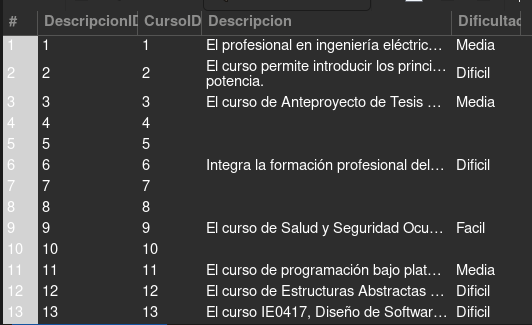
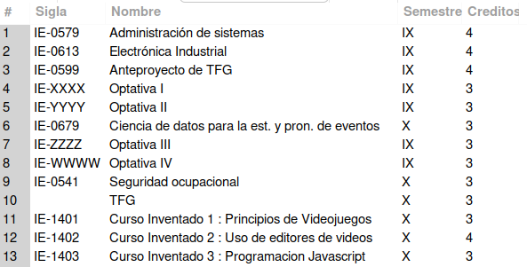
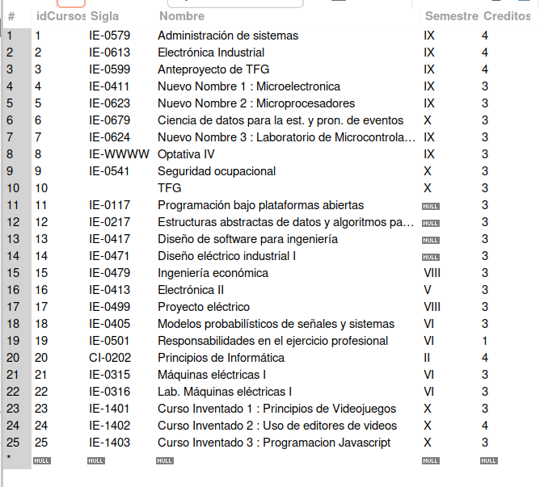
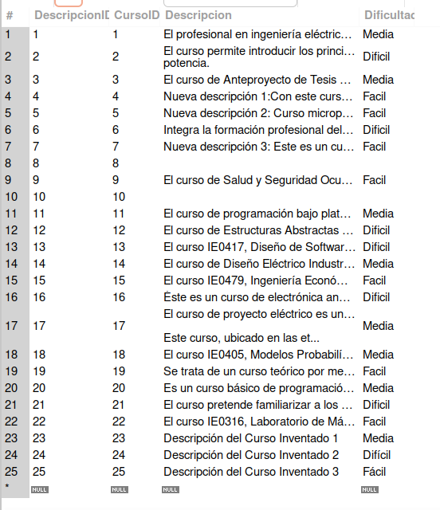

# Tarea6 / Oscar Porras Silesky

### Parte Teórica / Preguntas sobre Bases de Datos

#### 1. ¿Qué es una base de datos relacional y cuáles son sus características fundamentales?
Una base de datos relacional es un tipo de base de datos que organiza la información en tablas relacionadas entre sí. Las características fundamentales incluyen:
- **Estructura tabular**: Los datos se almacenan en tablas compuestas por filas y columnas.
- **Integridad de datos**: Se asegura mediante el uso de claves primarias y claves foráneas.
- **Manipulación de datos**: Se realiza a través de operaciones como selección, inserción, actualización y eliminación.
- **Consultas eficientes**: Se utilizan lenguajes como SQL para realizar consultas complejas de manera eficiente.

#### 2. ¿Cuál es la diferencia entre una clave primaria y una clave candidata en una base de datos relacional?
- **Clave Primaria**: Es un conjunto de uno o más campos que identifican de manera única cada fila en una tabla. No puede contener valores nulos.
- **Clave Candidata**: Es un conjunto de atributos que podrían servir como clave primaria, es decir, también son únicos para cada fila y no contienen valores nulos. La diferencia principal es que la clave primaria es la clave candidata seleccionada para identificar registros.

#### 3. ¿Qué son las claves foráneas y cómo se utilizan para mantener la integridad referencial en una base de datos?
Las claves foráneas son atributos en una tabla que hacen referencia a las claves primarias de otra tabla. Se utilizan para mantener la integridad referencial, asegurando que no se pueda agregar una referencia a una entidad que no existe. Esto ayuda a mantener la consistencia y la fiabilidad de los datos.

#### 4. ¿Qué es una transacción en el contexto de bases de datos y cuáles son las propiedades ACID que debe cumplir?
Una transacción en bases de datos es una serie de operaciones que se ejecutan como una unidad lógica de trabajo. Para asegurar la confiabilidad, una transacción debe cumplir las propiedades ACID:
- **Atomicidad**: La transacción se realiza en su totalidad o no se realiza en absoluto.
- **Consistencia**: La transacción transforma la base de datos de un estado consistente a otro.
- **Aislamiento**: Los efectos intermedios de una transacción en proceso son invisibles para otras transacciones.
- **Durabilidad**: Una vez que la transacción se ha completado, sus efectos son permanentes.

#### 5. ¿Qué son las vistas (views) en SQL y cuáles son los beneficios y limitaciones de su uso?
Las vistas en SQL son representaciones virtuales de una o más tablas. Se crean con consultas y se comportan aparentemente como tablas regulares. Los beneficios incluyen:
- **Seguridad**: Limita el acceso a los datos al exponer solo una parte de ellos.
- **Simplicidad**: Simplifica las consultas complejas, actuando como una abstracción que oculta la complejidad.
- **Consistencia**: Proporciona una interfaz constante a los datos, incluso si las estructuras subyacentes cambian.

Las limitaciones son:
- **Rendimiento**: Puede ser inferior al de las consultas directas debido al procesamiento adicional.
- **Actualizaciones**: No todas las vistas son actualizables, y las vistas que involucran múltiples tablas o funciones agregadas generalmente no lo son.

#### 6. ¿Qué es la normalización en bases de datos y cuáles son las diferentes formas normales (normal forms)?
La normalización en bases de datos es un proceso para reducir la redundancia y mejorar la integridad de los datos mediante la organización de campos y relaciones de tablas. Las formas normales son un conjunto de reglas para evaluar el nivel de normalización de una base de datos. Las principales son:
- **Primera forma normal (1NF)**: Requiere que todos los valores de las columnas sean atómicos y que la tabla tenga una clave primaria.
- **Segunda forma normal (2NF)**: Además de cumplir con 1NF, no debe haber dependencia funcional parcial de ningún atributo sobre la clave primaria.
- **Tercera forma normal (3NF)**: Requiere cumplir con 2NF y que no haya dependencias funcionales transitivas en atributos no primarios.
- **Forma normal de Boyce-Codd (BCNF)**: Una versión más estricta de 3NF, donde cada determinante es una clave candidata.

#### 7. ¿Cómo funcionan los índices en SQL y cuál es su impacto en el rendimiento de las consultas?
Los índices en SQL son estructuras de datos que mejoran la velocidad de las operaciones de recuperación de datos, pero pueden ralentizar las operaciones de inserción, actualización y eliminación debido al mantenimiento adicional. Funcionan creando un punto de acceso rápido a los datos que se almacenan de manera más eficiente. El impacto en el rendimiento de las consultas es significativo, especialmente en tablas grandes, ya que permiten evitar la lectura secuencial de toda la tabla.

#### 8. ¿Qué es SQL Injection y cuáles son las mejores prácticas para prevenir este tipo de ataque?
SQL Injection es una técnica de ataque que consiste en insertar o "inyectar" un código SQL malicioso a través de los datos de entrada que se ejecutan en el servidor de base de datos. Para prevenirlo, las mejores prácticas incluyen:
- Utilizar consultas parametrizadas o procedimientos almacenados para asegurar que los parámetros sean tratados como datos y no como código.
- Validar y sanitizar todas las entradas de los usuarios para asegurar que cumplen con los formatos esperados.
- Aplicar el principio de menor privilegio, limitando los permisos de las cuentas de bases de datos utilizadas en las aplicaciones.

#### 9. ¿Qué son los procedimientos almacenados (stored procedures) en SQL y cómo pueden mejorar la eficiencia y seguridad de las operaciones de base de datos?
Los procedimientos almacenados son bloques de código SQL que se almacenan en la base de datos y se ejecutan desde la aplicación. Mejoran la eficiencia ya que el código se compila una vez y se almacena para ejecuciones posteriores, reduciendo la carga de compilación en el servidor de base de datos. En cuanto a la seguridad, los procedimientos almacenados encapsulan el código de operaciones, lo que ayuda a prevenir inyecciones de SQL y reduce la exposición de datos.

#### 10. ¿Cómo se implementan las relaciones uno a uno, uno a muchos y muchos a muchos en una base de datos relacional y qué consideraciones se deben tener en cuenta en cada caso?
- **Relaciones uno a uno**: Se implementan mediante la inclusión de una clave primaria de una tabla como clave única en otra tabla. Es importante asegurarse de que la integridad referencial se mantenga correctamente para evitar inconsistencias.
- **Relaciones uno a muchos**: Se manejan incluyendo una clave primaria de la tabla principal como una clave foránea en la tabla secundaria. Deben diseñarse cuidadosamente para garantizar que las operaciones de actualización y eliminación no violen la integridad de los datos.
- **Relaciones muchos a muchos**: Requieren una tabla intermedia que incluya las claves primarias de ambas tablas relacionadas como claves foráneas. Esta tabla facilita la gestión de las relaciones y ayuda a mantener la integridad referencial y la normalización.

### Parte Práctica /

#### Creación del Esquema

1. **Creación del Esquema de la Base de Datos**
    - Esquema: `Tarea06DB`

        

        

2. **Creación de la Tablas `Cursos`, `Requisitos` y `Descripciones`**

#### Inserción de Datos

1. **Inserción de Datos en la Tabla `Cursos`**

    

    

    

    

2. **Inserción de Datos en la Tabla `Requisitos`**

    

3. **Inserción de Datos en la Tabla `Descripciones`**

    

    

#### Creación de Datos

##### 1. **Agregar nuevos cursos inventados por los estudiantes:**

##### 2. **Agregar descripciones para los nuevos cursos inventados:**

#### Lectura de Datos

##### 1. Mostrar cursos con sus descripciones y dificultades

##### 2. Consultar requisitos de un curso específico

##### 3. Listar cursos que no son optativos

#### Actualización de Datos

##### 1. Actualizar el nombre y créditos de 3 cursos optativos

##### 2. Actualizar la descripción y dificultad de 3 cursos existentes

#### Eliminación de Datos

##### 1. Eliminar un curso inventado y 2 cursos del plan y sus descripciones asociadas

##### 2. Verificar Eliminación

##### 3. Eliminar requisitos de 2 cursos específicos

.png)

